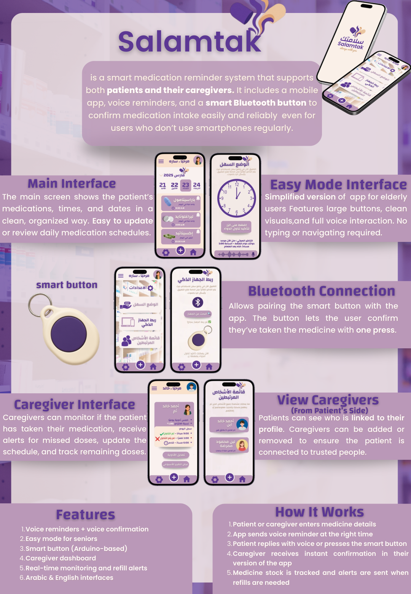

# Salamtak

<p align="center">
  
</p>

Salamtak is a smart medication reminder system that supports both patients and caregivers.
It combines a Flutter mobile app, voice reminders, and an Arduino-based Bluetooth smart button to confirm medication intake.

## What’s Included in This Repo
- **Flutter demo app UI** (`app/lib/main.dart`) showing the main screens (Main, Easy Mode, Bluetooth, Caregiver)
- **Arduino button sketch** (`hardware/arduino/salamtak_button/salamtak_button.ino`)
- **Poster + screenshots** inside `assets/`

## Screens (from design)
<p align="center">
  
</p>

<p align="center">
  
</p>

## Run (Flutter)
```bash
cd app
flutter pub get
flutter run
```

## Hardware (Arduino)
Open `hardware/arduino/salamtak_button/salamtak_button.ino` in Arduino IDE and upload.

## License
MIT License (see LICENSE)
